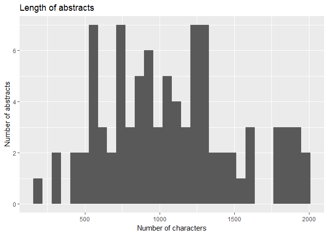
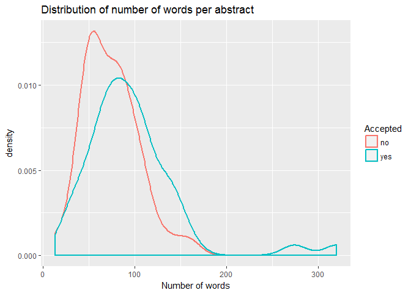
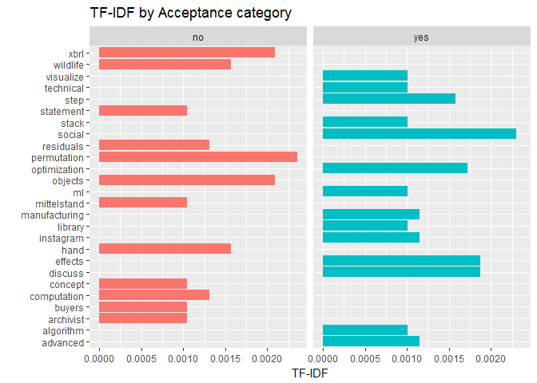

# Writing a conference abstract the data science way


Conferences are an ideal platform to share your work with the wider community. 
However as we all know conferences require potential speakers to submit abstracts
about their talk. And writing abstracts is not necessarily the most rewarding work out there. I have actually never written one so when asked to prepare abstracts for this year's 
conferences I didn't really know where to start. 

So I did what any sane person would do: get data. As Mango has organised a number of EARL 
conferences there is a good deal of abstracts available, both accepted and not accepted. 
In this blogpost I'm going to use the **tidytext** package to analyse these abstracts and see 
what distinguishes the accepted abstracts from the rest. 

Disclaimer: the objective of this blogpost is not to present a rigorous investigation into
conference abstracts but rather an exploration of and potential use for the **tidytext** package.

## The data
I don't know what it's like for other conferences but for EARL all abstracts are submitted 
through an online form. I'm not sure if these forms are stored in a database but I received them as a PDF. To convert the PDF's to text I make use of the *pdftotext* program as outlined in this [stackoverflow thread](stackoverflow.com/questions/21445659/use-r-to-convert-pdf-files-to-text-files-for-text-mining).


```r
list_of_files <- list.files("Abstracts Received/", pattern=".pdf", full.names=TRUE)
convert_pdf <- function(fileName){
  outputFile <- paste0('"', gsub('.pdf', '.txt', fileName),'"')
  inputFile <- paste0('"', fileName, '"')
  # I turned the layout option on because the input is a somewhat tabular layout
  command <- paste('"C:/Program Files/xpdf/bin64/pdftotext.exe" -layout', inputFile, outputFile)
  system(command, wait=FALSE)
}
result <- map(list_of_files, convert_pdf)
failures <- length(list_of_files) - sum(unlist(result))
if(failures>0){
  warning(sprintf("%i files failed to convert", c(failures))
}
```

Now that I have converted the files I can read them in and extract the relevant fields.


```r
# load functions extract_abstracts(), remove_punctuation()
source('Scripts/extract_abstracts.R')

input_files <- list.files("Abstracts Received/", pattern=".txt", full.names=TRUE)

acceptance_results <- read_csv("Abstracts Received/acceptance_results.csv") %>% 
  mutate(Title=remove_punctuation(Title), Title=str_sub(Title, end=15)) %>% 
  rename(TitleShort=Title)

# the conversion to text created files with an "incomplete final line" for which
# readLines generates a warning, hence the suppressWarnings
input_data <- suppressWarnings(map(input_files, readLines)) %>% 
  map_df(extract_abstracts) %>% 
  mutate(AbstractID=row_number(), TitleShort=str_sub(Title, end=15)) %>% 
  left_join(acceptance_results, by="TitleShort") %>% 
  filter(!is.na(Accepted)) %>% 
  select(AbstractID, Abstract, Accepted)

# a code chunk that ends with a plot is a good code chunk
qplot(map_int(input_data$Abstract, nchar)) + 
  labs(title="Length of abstracts", x="Number of characters", y="Number of abstracts")
```

<!-- -->

## The analysis
So now that I have the data ready I can apply some **tidytext** magic. I will first convert the data into a tidy format, then clean it up a bit and finally create a few visualisations.


```r
data(stop_words)
tidy_abstracts <- input_data %>% 
  mutate(Abstract=remove_punctuation(Abstract)) %>% 
  unnest_tokens(word, Abstract) %>% # abracadabra!
  anti_join(stop_words %>% filter(word!="r")) %>% # In this case R is a word
  filter(is.na(as.numeric(word))) # filter out numbers

# my personal mantra: a code chunk that ends with a plot is a good code chunk
tidy_abstracts %>% 
  count(AbstractID, Accepted) %>% 
  ggplot() +
  geom_density(aes(x=n, colour=Accepted), size=1) +
  labs(title="Distribution of number of words per abstract", x="Number of words")  
```

<!-- -->

The abstracts with a higher number of words have a slight advantage but I wouldn't bet on it. There is something to be said for being succinct. But what really matters is obviously content so let's have a look at what words are commonly used. 


```r
tidy_abstracts %>% 
  count(word, Accepted,  sort=TRUE) %>% # count the number of observations per category and word
  group_by(Accepted) %>% 
  top_n(20) %>% # select the top 20 counts per category
  ungroup() %>% 
  ggplot() +
  geom_col(aes(x=word, y=n, fill=Accepted), show.legend = FALSE) +
  coord_flip() +
  labs(x="", y="Count", title="Wordcount by Acceptance category") +
  facet_grid(~ Accepted)
```

<!-- -->

Certainly an interesting graph! It may have been better to show the proportions instead of counts as the number of abstracts in each category are not equal. Nevertheless the conclusion remains the same. The words "r" and "data" are clearly the most common. However what is more interesting is that abstracts in the "yes" category use certain words significantly more often than abstracts in the "no" category and vice versa (more often because a missing bar doesn't necessarily mean a zero observation). For example, the words "science", "production" and "performance" occur more often in the "yes" category. Vice versa, the words "tools", "product", "package" and "company(ies)" occur more often in the "no" category. Also, the word "application" occurs in its singular form in the "no" category and in its plural form in the "yes" category. Certainly, at EARL we like our applications to be plural, it is in the name after all.

There is one important caveat with the above analysis and that is to do with the frequency of words within abstracts. The overall frequencies aren't really that high and one abstract's usage of a particular word can make it seem more important than it really is. Luckily the **tidytext** package provides a solution for that as I can now easily calculate the [TF-IDF](http://tidytextmining.com/tfidf.html#term-frequency-in-jane-austens-novels) score.   


```r
tidy_abstracts %>% 
  count(Accepted, word, sort=TRUE) %>% # count the number of observations per category and word
  bind_tf_idf(word, Accepted, n) %>% # calculate tf-idf
  group_by(Accepted) %>% 
  top_n(10) %>% # select the top 10 scores per category
  ungroup() %>% 
  ggplot() +
  geom_col(aes(x=word, tf_idf, fill=Accepted), show.legend = FALSE) + 
  labs(x="", y="TF-IDF", title="TF-IDF by Acceptance category") +
  coord_flip() +
  facet_grid(~ Accepted)
```

<!-- -->

Note that I have aggregated the counts over the Acceptance category as I'm interested in what words are important within a category and not within a particular abstract. There isn't an obvious pattern visible in the results but I can certainly hypothesise. Words like "algorithm", "effects", "visualize", "ml" and "optimization" point strongly towards the application side of things. Whereas words like "concept", "objects" and "statement" are softer and more generic. XBRL is the odd one out here but [interesting](https://en.wikipedia.org/wiki/XBRL) in it's own right, whoever submitted that abstract should perhaps consider re-submitting as it's quite unique.  

## Next Steps

That's it for this blogpost but here are some next steps I would do if I had more time:

* Add more abstracts from previous years / other conferences
* Analyse combination of words (n-grams) to work towards what kind of sentences should go into an abstract
* The content isn't the only thing that matters. By adding more metadata (time of submission, previously presented, etc.) the model can be made more accurate
* Try out topic modeling on the accepted abstracts to help with deciding what streams would make sense
* Train a neural network with all abstracts and generate a winning abstract [insert evil laugh]

## Conclusion

In this blogpost I have explored text data taken from abstract submissions to the EARL conference using the fabulous **tidytext** package. I analysed words from abstracts that were accepted versus those that weren't and also compared their TF-IDF score. If you want to know more about the **tidytext** package come to the [Web Scraping and Text Mining](http://www.londonr.org/download/Workshop%20-%20Web%20Scraping%20and%20Text%20Analysis%20in%20R.pdf) workshop my colleagues Nic Crane and Beth Ashlee will be giving preceding the LondonR meetup this Tuesday the 28th of March. Also, if this blogpost has made you want to write an abstract, we are still accepting submissions for [EARL London](https://earlconf.com/abstracts/) and [EARL San Fransisco](https://earlconf.com/abstracts/) (I promise I won't use it for a blogpost).

As always, the code for this post can be found on [GitHub](https://github.com/MangoTheCat/blog_analysis_abstracts).

